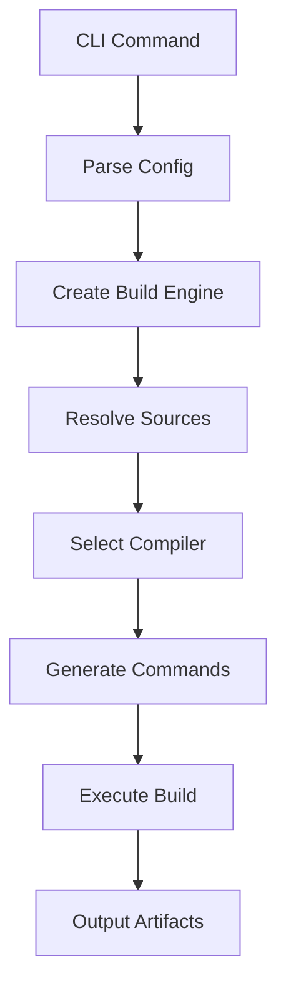

# Architecture

This document describes the internal architecture of Takwin.

## Overview

Takwin is built with a clean, modular architecture using Go's interface-based design patterns.

## Project Structure

```
takwin/
├── main.go                      # Entry point
├── cmd/                         # CLI commands (Cobra)
│   ├── root.go                  # Root command
│   ├── build.go                 # Build command
│   ├── clean.go                 # Clean command
│   └── list.go                  # List command
├── internal/
│   ├── config/                  # Configuration handling
│   │   ├── config.go            # TOML loading & validation
│   │   └── config_test.go       # Tests
│   ├── build/
│   │   ├── engine.go            # Build orchestration
│   │   └── engine_test.go       # Tests
│   ├── compiler/
│   │   ├── adapter.go           # Compiler implementations
│   │   └── adapter_test.go      # Tests
│   ├── platform/
│   │   └── adapter.go           # Platform-specific code
│   └── sources/
│       ├── resolver.go          # File pattern resolution
│       └── resolver_test.go     # Tests
├── examples/                    # Example projects
├── docs/                        # Documentation
└── go.mod                       # Go module definition
```

## Core Components

### 1. CLI Layer (`cmd/`)

Built with [Cobra](https://github.com/spf13/cobra), provides the command-line interface.

**Commands:**
- `build` - Build project targets
- `clean` - Clean build artifacts
- `list-targets` - List available targets

### 2. Configuration (`internal/config/`)

Handles TOML configuration parsing and validation.

**Key Types:**
```go
type Config struct {
    Project Project
    Build   Build
    Targets []Target
}
```

**Responsibilities:**
- Parse `build.toml` files
- Validate configuration
- Provide target lookup

### 3. Build Engine (`internal/build/`)

Orchestrates the build process.

**Key Type:**
```go
type Engine struct {
    config   *config.Config
    compiler compiler.Adapter
    platform platform.Adapter
    resolver sources.Resolver
}
```

**Responsibilities:**
- Coordinate build process
- Resolve source files
- Generate compiler commands
- Manage output directories

### 4. Compiler Adapters (`internal/compiler/`)

Provides abstraction over different compilers.

**Interface:**
```go
type Adapter interface {
    Name() string
    SupportsLanguage(lang string) bool
    BuildCompileCommand(ctx *Context) []string
    BuildStaticLibraryCommand(ctx *Context) []string
}
```

**Implementations:**
- GCC Adapter
- Clang Adapter
- MSVC Adapter

### 5. Platform Adapters (`internal/platform/`)

Handles platform-specific behavior.

**Responsibilities:**
- Add platform-specific file extensions
- Handle path separators
- Platform detection

### 6. Source Resolver (`internal/sources/`)

Resolves source file patterns to actual files.

**Implementations:**
- Glob Resolver - Pattern matching
- Explicit Resolver - Direct file lists
- Smart Resolver - Combination of both

## Data Flow



## Design Patterns

### 1. Adapter Pattern

Used for compiler and platform abstraction:

```go
// Compiler interface
type Adapter interface {
    BuildCompileCommand(ctx *Context) []string
}

// GCC implementation
type GccAdapter struct{}
func (g *GccAdapter) BuildCompileCommand(ctx *Context) []string {
    // GCC-specific implementation
}

// Clang implementation
type ClangAdapter struct{}
func (c *ClangAdapter) BuildCompileCommand(ctx *Context) []string {
    // Clang-specific implementation
}
```

### 2. Strategy Pattern

Used for source file resolution:

```go
type Resolver interface {
    Resolve(patterns []string, excludePatterns []string) ([]string, error)
}

// Different strategies
type GlobResolver struct{}
type ExplicitResolver struct{}
type SmartResolver struct{}
```

### 3. Builder Pattern

Used for constructing build contexts:

```go
type Context struct {
    Sources      []string
    Output       string
    TargetType   TargetType
    IncludePaths []string
    Libraries    []string
    // ...
}
```

## Testing Strategy

### Unit Tests

Each package has comprehensive unit tests:

```
internal/config/config_test.go      - Configuration parsing
internal/build/engine_test.go       - Build engine logic
internal/compiler/adapter_test.go   - Compiler adapters
internal/sources/resolver_test.go   - Source resolution
```

### Test Coverage

- **Target**: >85% code coverage
- **Current**: ~85% (config: 82%, compiler: 86%, sources: 90%, build: 80%)

### Testing Tools

- `testing` - Go standard library
- `testify` - Assertions and mocking

## Error Handling

Takwin uses Go's idiomatic error handling:

```go
if err := engine.BuildTarget(name); err != nil {
    return fmt.Errorf("build failed: %w", err)
}
```

**Error Types:**
- Configuration errors
- File resolution errors
- Build errors
- Validation errors

## Performance Considerations

### 1. Fast Startup

- Compiled binary (no interpreter)
- Minimal dependencies
- Lazy initialization

### 2. Efficient File Resolution

- Glob pattern caching
- Parallel file operations (planned)

### 3. Memory Efficiency

- Streaming file operations
- Minimal allocations
- Efficient data structures

## Future Architecture

### Planned Improvements

1. **Incremental Builds**
   - Dependency tracking
   - Change detection
   - Selective rebuilds

2. **Parallel Compilation**
   - Goroutine-based parallelism
   - Build graph optimization

3. **Plugin System**
   - Dynamic plugin loading
   - Custom compiler support
   - Build hooks

4. **Caching Layer**
   - Build artifact caching
   - Remote cache support
   - Cache invalidation

## Dependencies

### Direct Dependencies

```go
require (
    github.com/BurntSushi/toml v1.3.2      // TOML parsing
    github.com/magefile/mage v1.15.0       // Task runner
    github.com/spf13/cobra v1.8.0          // CLI framework
    github.com/spf13/viper v1.18.2         // Configuration
    github.com/stretchr/testify v1.8.4     // Testing
)
```

### Why These Dependencies?

- **Cobra**: Industry-standard CLI framework
- **Viper**: Flexible configuration management
- **TOML**: Simple, readable config format
- **Testify**: Better test assertions
- **Mage**: Go-based task runner

## Code Organization Principles

### 1. Package Structure

- `cmd/` - User-facing commands
- `internal/` - Internal implementation (not importable)
- `docs/` - Documentation
- `examples/` - Example projects

### 2. Interface-Based Design

All major components use interfaces for:
- Testability
- Flexibility
- Extensibility

### 3. Separation of Concerns

Each package has a single, well-defined responsibility.

### 4. Minimal External Dependencies

Only essential, well-maintained dependencies are used.

## Contributing to Architecture

When adding new features:

1. Follow existing patterns
2. Use interfaces for abstraction
3. Write comprehensive tests
4. Document design decisions
5. Consider performance implications

See [Contributing Guide](CONTRIBUTING.md) for more details.
